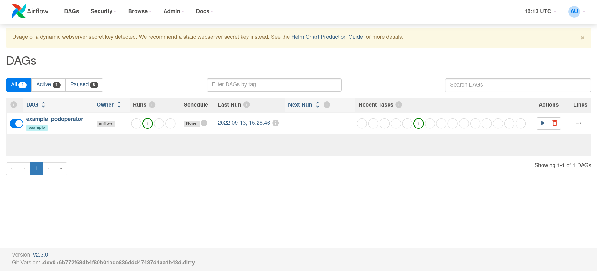

# Running Airflow on minikube

## Introduction

Apache Airflow is an open-source workflow management platform that can be used to schedule and monitor workflows in Python.

Running Airflow on Kubernetes can offer significant management and scalability benefits for the growing number of workflows.

This repository shows how to deploy Airflow on Kubernetes(minikube) using Helm and provides sample DAGs to run on the Kubernetes.

## Prerequisites

- Docker (tested with 20.10.17)
- minikube (tested with v1.26.1)
- helm (tested with v3.9.4)

## Getting Started

### Starting a local Kubernetes cluster using minikube

```bash
$ minikube start --vm-driver=docker --cpus 8 --memory 16g --kubernetes-version v1.21.14

😄  minikube v1.26.1 on Ubuntu 22.04
✨  Using the docker driver based on user configuration
📌  Using Docker driver with root privileges
👍  Starting control plane node minikube in cluster minikube
🚜  Pulling base image ...
🔥  Creating docker container (CPUs=8, Memory=16384MB) ...
🐳  Preparing Kubernetes v1.21.14 on Docker 20.10.17 ...
    ▪ Generating certificates and keys ...
    ▪ Booting up control plane ...
    ▪ Configuring RBAC rules ...
🔎  Verifying Kubernetes components...
    ▪ Using image gcr.io/k8s-minikube/storage-provisioner:v5
🌟  Enabled addons: storage-provisioner, default-storageclass
💡  kubectl not found. If you need it, try: 'minikube kubectl -- get pods -A'
🏄  Done! kubectl is now configured to use "minikube" cluster and "default" namespace by default
```

Ensure the cluster is ready.

```bash
$ minikube kubectl -- get po -A

NAMESPACE     NAME                               READY   STATUS    RESTARTS   AGE
kube-system   coredns-558bd4d5db-7zr69           1/1     Running   0          33s
kube-system   etcd-minikube                      1/1     Running   0          41s
kube-system   kube-apiserver-minikube            1/1     Running   0          41s
kube-system   kube-controller-manager-minikube   1/1     Running   0          48s
kube-system   kube-proxy-2v5n8                   1/1     Running   0          33s
kube-system   kube-scheduler-minikube            1/1     Running   0          48s
kube-system   storage-provisioner                1/1     Running   0          46s
```

### Configuring required resources for Airflow deployment

Add airflow chart repository.

```bash
helm repo add apache-airflow https://airflow.apache.org
helm repo update
```

Create `airflow` namespace and hostpathes.

```bash
minikube kubectl -- create namespace airflow
```

Mount `airflow_home` into minikube (using tmux).

```bash
$ minikube mount ${PWD}/airflow_home:/opt/airflow

* Mounting host path /home/tom/huang06/airflow-minikube/airflow_home into VM as /opt/airflow ...
  - Mount type:
  - User ID:      docker
  - Group ID:     docker
  - Version:      9p2000.L
  - Message Size: 262144
  - Options:      map[]
  - Bind Address: 192.168.49.1:42849
* Userspace file server: ufs starting
* Successfully mounted /home/tom/huang06/airflow-minikube/airflow_home to /opt/airflow

* NOTE: This process must stay alive for the mount to be accessible ...
```

Create PV/PVC resources.

```bash
minikube kubectl -- apply -f volumes.yaml
```

Ensure the PV/PVC resources are avaiable.

```bash
$ minikube kubectl -- get pvc -n airflow

NAMESPACE   NAME                STATUS   VOLUME              CAPACITY   ACCESS MODES   STORAGECLASS           AGE
airflow     airflow-dag         Bound    airflow-dag         2Gi        RWX            airflow-storageclass   109s
```

Verify whether the example file can been mounted into Pod.

```bash
minikube kubectl -- apply -f pv-pod.yaml
```

```bash
$ minikube kubectl -- exec -it task-pv-pod -n airflow -- ls -al /opt/airflow/dags/

total 1
-rw-rw-r--    1 1000     999            689 Sep 13 13:09 example_podoperator.py
```

Delete the Pod.

```bash
minikube kubectl -- delete --force -f pv-pod.yaml
```

### Deploying Airflow on Kubernetes

Next, Deploy Airflow on the minikube using Helm.

```bash
$ helm install airflow apache-airflow/airflow --namespace airflow -f override.yaml --version 1.6.0 --debug

...
Thank you for installing Apache Airflow 2.3.0!

Your release is named airflow.
You can now access your dashboard(s) by executing the following command(s) and visiting the corresponding port at localhost in your browser:

Airflow Webserver:     kubectl port-forward svc/airflow-webserver 8080:8080 --namespace airflow
Default Webserver (Airflow UI) Login credentials:
    username: admin
    password: admin
Default Postgres connection credentials:
    username: postgres
    password: postgres
    port: 5432

You can get Fernet Key value by running the following:

    echo Fernet Key: $(kubectl get secret --namespace airflow airflow-fernet-key -o jsonpath="{.data.fernet-key}" | base64 --decode)

###########################################################
#  WARNING: You should set a static webserver secret key  #
###########################################################

You are using a dynamically generated webserver secret key, which can lead to
unnecessary restarts of your Airflow components.

Information on how to set a static webserver secret key can be found here:
https://airflow.apache.org/docs/helm-chart/stable/production-guide.html#webserver-secret-key
```

### Using port-forwarding to access the Web Server

Expose the webserver running in the Kubernetes (using tmux).

```bash
$ minikube kubectl -- port-forward svc/airflow-webserver 58080:8080 --namespace airflow --address=0.0.0.0

Forwarding from 0.0.0.0:58080 -> 8080
```

Use `0.0.0.0:58080` to access the Airflow webserver.



## Cleanup

Method1: delete the Airflow resources.

```bash
helm uninstall airflow -n airflow
minikube kubectl -- delete -f volumes.yaml
minikube kubectl -- delete ns airflow
```

Method2: delete the Kubernetes cluster.

```bash
minikube delete
```
